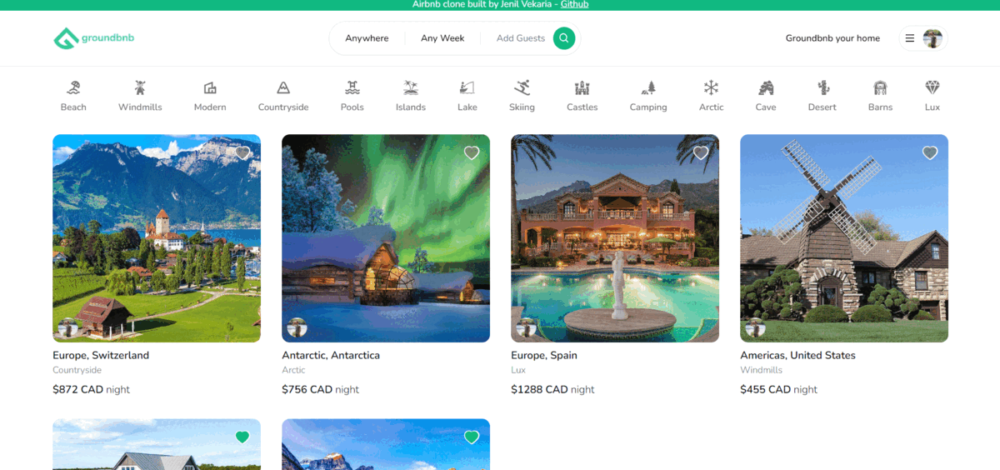

<!-- PROJECT LOGO -->
<p align="center">
  <a href="https://groundbnb-demo.vercel.app">
       
  </a>

  <h3 align="center">Groundbnb</h3>

  <p align="center">
    🗻 Groundbnb is an airbnb clone built using Next.js and TypeScript ✈
    <br />
    <br />
    <a href="https://groundbnb-demo.vercel.app">Live Demo</a>
  </p>
</p>


<!-- ABOUT THE PROJECT -->
## 📷 Screenshots

  <a href="https://groundbnb-demo.vercel.app">
    
  </a>

<!-- FEATURE SECTION -->

## ✨ Features

- Listing creation
- Reservation creation
- Advanced filtering (location map + calendar + amenities)
- Advanced pricing calculation
- Favorite properties
- Image uploading
- Email, Github, and Google authentication
- Lighting fast loading (Next.js 13 Server Componenents)

<!-- TECHNOLOGY SECTION -->

## 🛠️Technologies

| <p align="center"><br/>NextJs</p> | <p align="center"><br/>TypeScript</p> | <p align="center"><br/>Tailwind CSS</p> | <p align="center"><br/>MongoDB</p> |
|---|----------------------------|----------|-----------|
| <p align="center"><br/>Next Auth</p> | <p align="center"><br/>Prisma ORM</p> | <p align="center"><br/>Cloudinary</p>  | <p align="center"><br/>Zustand</p> |


## 🚀 Quick start


### Step 1: Clone the repo

Fork the repository then clone it locally by doing

```sh
git clone https://github.com/Jenil-Vekaria/groundbnb.git
```

### Step 2: Install Dependencies

```sh
npm install
```

### Step 3: Setup .env

To run the server, you will need to step up `.env` variables

1. Create an account on [Cloundary](https://cloudinary.com/) and get your cloud name
2. Setup Github OAuth - [Guide](https://docs.github.com/en/apps/oauth-apps/building-oauth-apps/creating-an-oauth-app)
3. Setup Google OAuth - [Guide](https://support.google.com/cloud/answer/6158849?hl=en)

- create a new file <b>.env</b> in the root
- open [.env.EXAMPLE](./.env.EXAMPLE)
- copy the contents and paste it to the .env with valid keys

### Step 4: Run the Application

```
npm run dev
```

#### You are all setup!

### Give a ⭐, if you liked the project

## Author

- Github: [@Jenil-Vekara](https://github.com/Jenil-Vekaria)
- Portfolio: [Jenil-Vekaria.netlify.app](https://jenil-vekaria.netlify.app/)
- LinkedIn: [@JenilVekaria](https://www.linkedin.com/in/jenilvekaria/)
